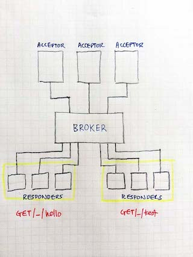

# Polyglot

_Polyglot is experimental and incomplete at the moment. Please use with caution and at your own risk!_


**Polyglot** allows programmers to collaborate and develop a single web app using multiple programming languages, libraries, environments and even different versions of the same language. 

What does this mean? 

It means no more [programming language wars](http://www.joelonsoftware.com/items/2006/09/01.html) -- programmers can use the best language for the job and/or their favorite language to write different parts of the same web app.

It can also mean no [dependency hell](http://en.wikipedia.org/wiki/Dependency_hell). Different parts of the same web app can use different libraries. So if you have a new feature that requires using a newer version of the same library you used before, you can just go ahead and use it.

This also means you can scale and evolve your web app, building on what you have built before, and taking down only those parts that you need to replace, and even replace your web app in a less destructive way. No more 'big bang' approach to upgrading your web platform! 

## A complex web framework 

So what's the catch? 

Polyglot *increases* the complexity in the effort to develop web apps. Unlike frameworks like Rails or Django or Express, Polyglot doesn't exist to make life easier for the programmer. In fact it adds the complexity of the application, not only in the deployment but also in the development. 

As a programmer you trade complexity and effort for something you think is more important for the web app you're creating. In Polyglot, we are trading complexity and effort for:

1. **Performance scalability** -- Polyglot responders are distributed and independent processes that can reside anywhere on a connected network
2. **Extensibility** -- by creating an acceptor as a controller in an existing web app, you can extend the applications through Polyglot
3. **Multi-lingual, independent development** -- Polyglot responders can be developed independently in different programming languages, libraries and environments

**Polyglot** is not for all web apps. You should only use Polyglot for web apps that need to be scaled in a highly performant way and/or need to be incrementally developed in multiple programming languages. For example, if your web app never needs to scale beyond a single server, you're probably better off using some other single language framework. And if once your web app is created, you or anyone else never need to add new features, Polyglot is probably not suitable either.

Why would you want to develop a web app in multiple programming languages? There are good, practical reasons:

1. Web apps you write are systems and they change over time and can be written or maintained by different groups of people. If you're not restricted to a particular platform or language, then the chances of getting an incrementally better piece of software is higher. 
2. You can switch out the poor-performing responders and replace them with higher-performing ones. Different responders can have different criteria for performance, ease-of-development, ease-of-maintenance or quick turnaround in development. With a single programming language you are often forced to accept a compromise. With multiple programming languages, you can choose the platform and language as what you need for that particular responder
3. Different responders can be written for specific performance gains or maintainability


Why is even a 'web framework'? Web frameworks make life easier for programmers by making it easier to create web apps. While the added complexity of writing web apps with Polyglot make things more difficult initially, over time, the application is easier to extend and to evolve. With a bigger picture in mind, Polyglot _does_ make life easier for programmers.


## Architecture

Polyglot has a very simple and basic architecture. It consists of 3 main components:

1. **Acceptor** - the acceptor is a HTTP interface that takes in a HTTP request and provides a HTTP response. The acceptor takes in a HTTP request converts it into messages and sends it to the Polyglot Broker. Then depending on what is asked, it will return the appropriate HTTP response. The default implementation of the acceptor is in Go. To extend an existing web app, you can also optionally implement the acceptor as a controller in that web app.
2. **Broker** - the broker is an intermediary that receives the messages that represent the HTTP request and forwards it to the corresponding responder. 
3. **Responder** - responders are standalone processes written in any language that receives messages from the broker and responds to it accordingly. In most web frameworks this is usually called the controller. However unlike most web framework controllers, the responders are actual independent processes that can potentially sit in any connected remote server. Responders contain the "business logic" of your code. 



Essentially, the Polyglot architecture revolves around using a broker to disassociate the processing units (responders) from the communications unit (acceptor), allowing the responders to be created in multiple languages.

### Flow

1. Client sents a HTTP request to the acceptor
2. The acceptor converts the request into JSON and sends it to the broker, and waits for a response
3. The broker routes the message to the correct responder
4. The responder processes the request message
5. The responder sends the response back to the broker. The response message is an array that has 4 elements -- the route ID, the HTTP status code, a map of headers, and a body.
6. The broker receives the response and uses the route ID to respond to the correct acceptor
7. The acceptor uses the HTTP status code, response headers and the body, creates a HTTP response and sends it to the client


### Acceptor

The **acceptor** is a communications unit that interacts with the external world (normally a browser but can also be another server calling an API). The default implementation is  written in Go. The acceptor is sessionless and its main task is to accept requests and sends them to the broker, then receives the response and reply to the requestor. The communications with the broker is through ZMQ.

You can also extend an existing application by creating a controller in that application as an acceptor. There can be one or more acceptors in a single Polyglot application, for load-balancing purposes.

### Broker

The **broker** is a load-balancing broker implemented in Go and communicates with both the acceptors and the responders through ZMQ. The broker queues responders that are registered with it and load balances amongst them using round-robin. 

### Responder

**Responders** are processing units that can be written in any programming language that can communicate with the broker through ZMQ. Responders are normally written as standalone processes. All responders essentially do the same thing, which is to process incoming requests and returns a message to the broker. Each responder must have a route ID, which is in the format of:

    <HTTP method>/_/<URL path>

For example `GET/_/hello/world` is a route ID. 

Each responder must also have a unique ID that identifies itself across all routes. It's the developer's responsibility to ensure the uniqueness of the ID as the broker will not check its uniqueness.

## Installation and setup

My development environment in OS X Mavericks but it should work fine with most *nix-based environments. 

First, [install ZeroMQ 4.0.4](http://zeromq.org/intro:get-the-software). 

Next, clone this repository in to a [Go workspace](http://golang.org/doc/code.html). The default acceptor is written in Go and you'll need to build it.

### Acceptor

The default Polyglot acceptor is written in Go. To install, just run:

    go build
    
This should create a program called `polyglot`. To run the default acceptor:

    ./polyglot
        
To configure the acceptor, modify the `config.json` file and restart the acceptor. The acceptor also creates a log file called `acceptor.log` that shows the acceptor's activities. 


### Broker

The Polyglot broker is written in Go. To install, go to the `broker` directory and run:

    go build
    
This should create a program called `broker`. To run the broker:

    ./broker

The broker creates a log file called `broker.log` that shows the broker's activities. There is a command line admin tool called `polyadm` in the `polyadm` directory.

### Responder

The set of example responders are in the `responders` directory. To run them, you can either start them individually or you can use [Foreman](https://github.com/ddollar/foreman) like I do. 

To start the responders individually, go to the respective directories for eg the `ruby` directory and do this:

    ruby responder.rb
    
This will start up the `hello` Ruby responder. Note that you have only started 1 responder. To start up and manage a bunch of responders, open up `Procfile` in the responders directory.

    hello_ruby: ruby -C ./ruby responder.rb
    hello_go: ./goresp/goresp

You will notice that the file consists of lines of configuration that starts up the responders. Now open up the file `.foreman`.

    concurrency: 
      hello_ruby=5,      
      hello_go=5

As you can see, each line after `concurrency:` is a responder. The number configuration is the number of responders you want to start up. In this case, I'm starting up 2 `hello_ruby`and `hello_go` responders each.

To start all the responders at once:

    foreman start
    
If you want to run this in the background without being cut off when you log out:

    nohup foreman start &
    
**Foreman is used for development and testing purposes only**. If you want to run this in production, use Foreman to export out the configuration files in Upstart or launchd etc. Foreman should not be used in production.

## Writing responders

Writing responders are quite easy. There are basically only a few steps to follow:

1. Connect to broker using whichever ZMQ library the language has
2. Set the identity of the responder (remember that it must be unique across all responders)
3. Establish the route ID. This is basically the HTTP method followed by `/_/` and then the route path. For example, if you want to set up a responder for a GET request going to the route `hello` then set up the route ID to be `GET/_/hello`
4. Send the route ID to the broker to register the responder
5. In a loop, first receive the request and process it
6. Then respond to the broker with an array of 4 elements, each element must be a String:
  1. The route ID
  2. The HTTP response status. For example, if everything is fine, this is 200, if you want to redirect, this will be 302, if it's an error it should be a 5xx
  3. A hash/map/dictionary of headers. You should try to put in at least the 'Content-Type' header
  4. The HTTP response body. This must be a string

The examples below shows how this can be done in various languages. The full list of responders are in the responders directory, including sample (Hello World type) responders for:

* C
* Ruby
* Go
* Python
* Java
* Node.js

Please send pull requests for sample responders in other languages!

## C

This example uses the high-level C library [CZMQ](https://github.com/zeromq/czmq). To build the responder, please build the CZMQ library first then run:

    make
    
This will create the file `responder` which you can run from command line as a binary.


```c
#include "czmq.h"
#include <uuid/uuid.h>
#define ROUTEID "GET/_/hello/c"

int main (void) {
    zctx_t *ctx = zctx_new ();
    void *responder = zsocket_new (ctx, ZMQ_REQ);

    char identity [37];
    uuid_t uuid;
    uuid_generate(uuid);
    uuid_unparse_lower(uuid, identity);
    
    zmq_setsockopt (responder, ZMQ_IDENTITY, identity, strlen (identity));
    zsocket_connect (responder, "tcp://localhost:4321");

    printf ("%s - %s responder ready\n", ROUTEID, identity);
    zstr_send(responder, ROUTEID);
    while (true) {
        char *msg = zstr_recv (responder);
        if (!msg) {
          printf ("No message received from broker");
          break;
        }        
        zstr_sendm (responder, ROUTEID);
        zstr_sendm (responder, "200");
        zstr_sendm (responder, "{\"Content-Type\": \"text/html\"}");
        zstr_send (responder, msg);
        zstr_free (&msg);
    }
    zctx_destroy (&ctx);
    return 0;
}
```

### Ruby

This example uses the [ffi-rzmq](https://github.com/chuckremes/ffi-rzmq) gem and returns a "Hello World" back to the browser.

```ruby
require 'securerandom'
require 'bundler'
Bundler.require

broker = "tcp://localhost:4321"
routeid = "GET/_/hello/ruby"
identity = SecureRandom.uuid

puts "#{routeid} - #{identity} responder ready"

ctx = ZMQ::Context.new
client = ctx.socket ZMQ::REQ
client.identity = identity
client.connect broker

client.send_string routeid
loop do
  request = String.new
  client.recv_string request
  response = [routeid, "200", "{\"Content-Type\": \"text/html\"}", "Hello World"]
  client.send_strings response
end
```

### Go

This example uses [Go ZMQ4 bindings](https://github.com/pebbe/zmq4) and returns the request (in JSON) to the browser.

```go
package main

import (
	zmq "github.com/pebbe/zmq4"
	"fmt"
  "code.google.com/p/go-uuid/uuid"
)

const (
	ROUTEID = "GET/_/hello/go"
)

func main() {
	responder, _ := zmq.NewSocket(zmq.REQ)
	defer responder.Close()

	identity := uuid.New()
	responder.SetIdentity(identity)
	responder.Connect("tcp://localhost:4321")

	fmt.Printf("%s - %s responder ready\n", ROUTEID, identity)
	responder.Send(ROUTEID, 0)

	for {
		msg, err := responder.RecvMessage(0)
		if err != nil {
      fmt.Println("Error in receiving message:", err)
			break //  Interrupted
		}
    resp := []string{"200", "{\"Content-Type\": \"text/html\"}", msg[0],}
    fmt.Println("Responding with:", resp)
		responder.SendMessage(ROUTEID, resp)
	}
}
```

### Python

This example uses [PyZMQ](https://github.com/zeromq/pyzmq) and returns "Hello World" to the browser.

```python
import zmq
import uuid

identity = str(uuid.uuid4())
routeid = "GET/_/hello/python"

context = zmq.Context(1)
responder = context.socket(zmq.REQ)
responder.setsockopt(zmq.IDENTITY, identity)
responder.connect("tcp://localhost:4321")

print "%s - %s responder ready" % (routeid, identity)

responder.send(routeid)

while True:
  request = responder.recv()
  if not request:
    break
  response = [routeid, "200", "{\"Content-Type\": \"text/html\"}", "Hello World"]
  responder.send_multipart(response)
```

### Java

This example returns the request to the browser. Use the `compile` file to compile the java class.

```java
import org.zeromq.ZMQ;
import java.util.UUID;

 
public class Hello {

  public static void main(String[] args) {
    ZMQ.Context context = ZMQ.context(1);
    String routeid = "GET/_/hello/java";
    String identity = UUID.randomUUID().toString();
    
    ZMQ.Socket socket = context.socket(ZMQ.REQ);
    socket.setIdentity(identity.getBytes());
    socket.connect ("tcp://localhost:4321");
 
    System.out.printf("%s - %s responder ready\n", routeid, identity);
    
    socket.send(routeid, 0);
    try {
      while (true) {
        String request = socket.recvStr();        
        
        socket.send(routeid, ZMQ.SNDMORE);
        socket.send("200", ZMQ.SNDMORE);
        socket.send("{\"Content-Type\": \"text/html\"}", ZMQ.SNDMORE);
        socket.send(request);
      }      
    } catch (Exception e) {
      socket.close();
      context.term();      
    } 
  }
}
```

### Node.js

This example uses the [node.js bindings](https://github.com/JustinTulloss/zeromq.node) to ZeroMQ. Install the 2 modules `node-uuid` and `zmq` before running this code.


```javascript
var zmq = require('zmq')
  , sock = zmq.socket('req');
var uuid = require('node-uuid');

routeid = "GET/_/hello/node";
identity = uuid.v4();
sock.identity = identity;
sock.connect('tcp://localhost:4321');
sock.send(routeid);

console.log('%s - %s responder ready', routeid, identity);

sock.on('message', function(msg){  
  sock.send(routeid, zmq.ZMQ_SNDMORE);
  sock.send("200", zmq.ZMQ_SNDMORE);
  sock.send("{\"Content-Type\": \"text/html\"}", zmq.ZMQ_SNDMORE);
  sock.send(msg);  
});
```
 

 
## Static files

To serve out static files, configure Polyglot to point to a directory you wish to serve the files from. For eg if you want to serve your files from the directory `public` you can change the settings in `config.json` like this:

```javascript
{
  "Acceptor"       : "0.0.0.0:8080",
  "ReadTimeout"    : 10,
  "WriteTimeout"   : 600,
  "RequestTimeout" : 2500,
  "RequestRetries" : 3,
  "Broker"         : "tcp://localhost:1234",
  "Static"         : "public"
}
```

All files (including files in the various subdirectories) can now be served from `http://<host>:8080/_static/` eg if you have a file `public/css/main.css` then you can access the file through `http://<host>:8080/_static/css/main.css`
  

## Sample web app

I wrote a sample web app called [Polyblog](https://github.com/sausheong/polyblog) that puts together a simple blog app using Polyglot.

## Extending an existing application

You can extend an existing web app by creating a controller in your application that emulates whatever the acceptor does (which is essentially to pack the HTTP request into JSON and send it to the broker, then wait for a response and pass it back to the calling client).

## Command line admin

The broker has a command line administration tool named `polyadm`, which is found in the `polyadmn` directory. To build it run:

    go build
    
Then run it like this:

   ./polyadm
   
There is limited functionality for the command line admin at the moment.

## Current limitations

Polyglot is currently pretty limited. While it can do all of the above, some normally expected capabilities of a web framework are not easily achieved (yet), including (but not limited to) session management and authentication. 


## Credits and feedback

The idea of separating the request acceptor and the workload has been around for a while, in particular the enterprise world has been doing [Service Oriented Architecture](http://en.wikipedia.org/wiki/Service-oriented_architecture) for a while, as with [Message-oriented middleware(MOM)](http://en.wikipedia.org/wiki/Message-oriented_middleware). Task queues where you have clients and workers is also a common pattern used in many systems. The idea of returning an array of status, headers and body was inspired by [WSGI](http://wsgi.readthedocs.org/en/latest/).

There is also feedback that Polyglot is similar to [Mongrel2](http://mongrel2.org/). I'm not familiar with Mongrel2, and a preliminary reading tells me that it sounds like fantastic software.
